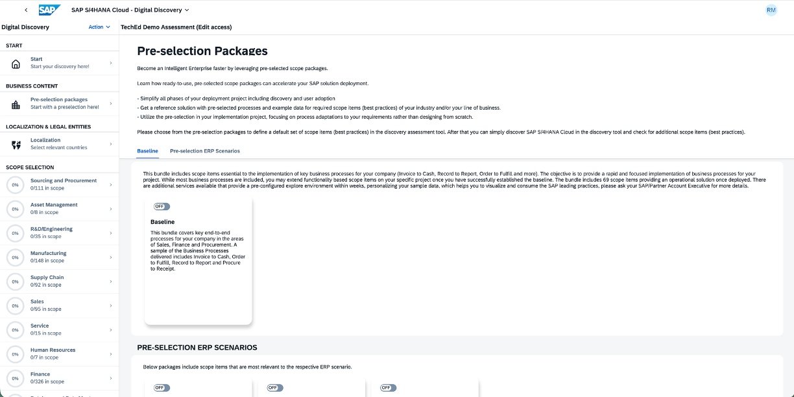
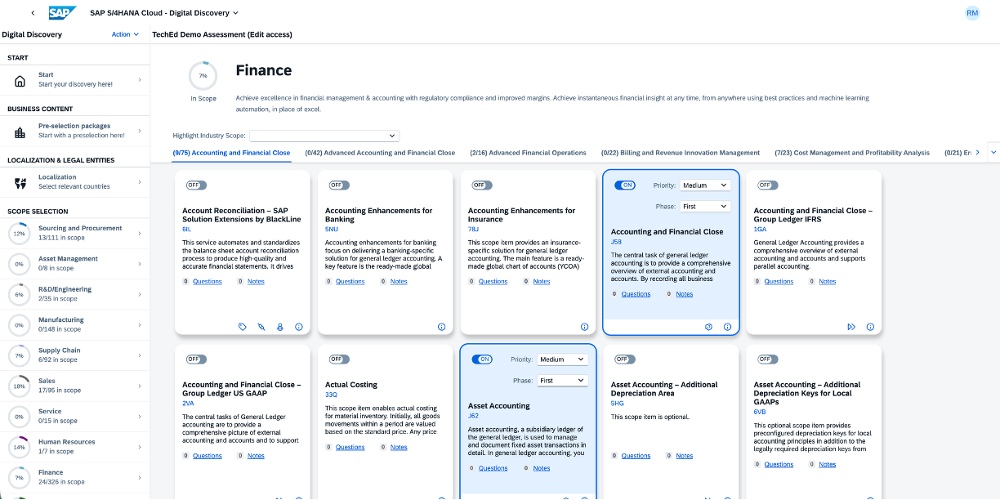

# Exercise - Digital Discovery Assessment

## 1. Setup your user

1. Open Google Chrome
2. Navigate to
https://techedrouter-a664064c8.dispatcher.hana.ondemand.com
> [IMPORTANT]
> This registration link will only work right now during the session. If you want to access the platform after TechEd, please bookmark the URL to your assessment that will open once you went through above link.

3. Login with your S- or P- user ID. This will ensure that you have access after TechEd as well.
4. In case you do not have a S- or P- user ID please use one of the P-user IDs below, but note that these won't work after TechEd.

> P-Users:
> 

## 2. What is a scope item?

Before we jump in we need to understand what a 'scope item' is.

> A scope item is a pre-configured, modular business process that provides a complete, activated set of functionalities for core business scenarios, like finance or human resources. These pre-built scope items, found in SAP Best Practices Explorer, accelerate implementation by offering ready-to-use "best practice" processes instead of starting from scratch.
More information for all scope items can be found on the [SAP Signavio Process Navigator](https://me.sap.com/processnavigator/SolS/EARL_SolS-013/2508?region=DE).

## 3. Select Baseline package

Lets accelerate the scope selection and browse to the pre-selection packages.

1. Open the section `Pre-selection packages`.
2. Select the bundle `Baseline`.

## 3. Browse through and select additional scope you like

1. Select e.g. LoB Finance.
2. All scope items that are selected are shown in blue. Select a scope item that is not yet selected.

## 4. Export Excel for CALM & JSON for CBC

In order to proceed with the actual implementation of SAP Cloud ERP we need to extract the JSON and Excel files that need to be imported into the next steps.

Early 2026 these steps will be automated but right now this involves a manual download and upload into the respective tools.

1. Navigate to the results section
2. Click on the Excel export button and save locally
3. Click on the JSON export button and save locally

## Summary & Next Steps

You've now finished the Digital Discovery Assessment exercises. Please continue with the next Exercise for SAP Cloud ALM.

Continue to - [Exercise 2 - SAP Cloud ALM](../ex2/Ex2-CALM.md)