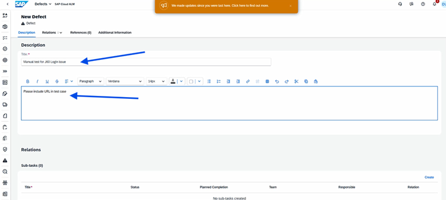

# Getting Started in SAP Cloud ALM – 30min

## Optional Exercise - Test Preparation and Execution

1.	Click the third icon on the left again to open the `Open Tasks overview`

2.	Click the 11th icon on the left (`Test Preparation`)

 

 
3.	The `Test Preparation` overview opens. Here, select *Finance* under the Scope filter

 
 
4.	Click on Test Case: `Accounting and Financial Close - J58 - DE`

5.	A window opens with the overview. Click the second tab: `Relations`

6.	Then click `Requirements` and `Assign`

7.	A window opens (`Assign Requirements`). Select the Requirement for Accounting and Financial Close (J58) `DT161-###`

 

8.	Click the `Save` button

9.	Set the `Status` from *In Preparation* to *Prepared* (in 
the header)

10.	Click `Save` again

 

11.	Go back to the `Test Preparation` overview. Click the `Create` button.

12.	The New Test Case window opens on the right. Enter the following:

 

13.	`Type`: Manual

14.	`Title`: Manual test for J60

15.	`Scope`: Finance

16.	`Solution Process`: Accounts Payable (J60)

17.	`Solution Process Flow Diagram`: J60 – 01 – Main (Germany+ many)

18.	Click `Save`

19.	Set all toggles to a check mark under Scope

 

20.	Click `Save` at the end
 
21.	The Content tab opens. Click `Edit` (pencil) for the first step.
  

22.	`Title`: Login

23.	`Instructions`: User: ABC, PW: xyz

24.	Click `OK`

 

25.	In the `Manual Test Case` overview, click `Save`

26.	Set the `Status` from In *Preparation* to *Prepared*

27.	Click the `Save` button again

28.	Click `Back`

29.	In the `Test Cases` overview, filter the `Status` for *Prepared*

 

30.	The two test cases should now appear

31.	Next, click the Test `Execution` symbol on the far left

  

 
32.	`Remove` the filter for Test Plan Status

33.	Click `Execute` for the Manual Test for J60

 
 
34.	Set the `Login step` from Set to Pass to Fail
  

35.	`Enter` URL missing in the comments

36.	`Save` and then click `Create defect`
  

37.	A window opens with `New Defect`

38.	`Title`: Manual Test for J60 Login issue

39.	`Description`: Please include URL in test case

40.	Click `Save`

## Return to main exercise
Return to Exercise 2 - SAP Cloud ALM - and continue with step 60: [Exercise 2 - SAP Cloud ALM](../ex2/Ex2-CALM.md)