# Getting Started in SAP Cloud ALM – 30min

## Exercise: 
1.	Open SAP Cloud ALM in a new browser tab
2.	Login with your Username and your password

    ```terraform
    Username: DT161-###@education.cloud.sap
    Password: Acce$$teched25
    ```

**Note1:** The workspace is already available, and you have been assigned as a team member to start the implementation. Always use your `User Number` instead of the `###` in this and all subsequent steps.

**Note 2:** Use the screenshots attached if you can`t find the right next click. The arrows in the screen shows the clicks. 

In case the screen looks different, check your filter settings or use the Browser refresh to reload the page. You can also always go back to your last screen with the in-App Back Button , top left corner (!)

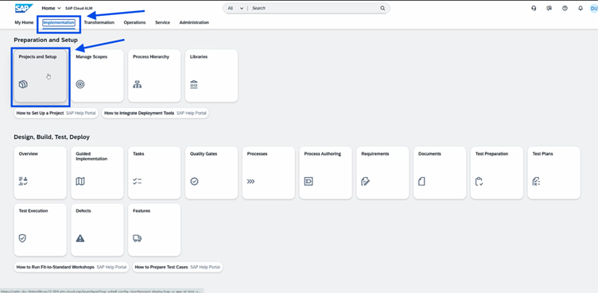
 

3.	Select the `Implementation` tab and then open `Projects and Setup`

4.	In the `Manage Projects` section, click the `Create` button

5.	A window opens on the right titled `New Project` with the tabs `General Information` and `Timeboxes`

6.	In the `General Information` tab, fill out the required fields step-by-step

7.	Enter `DT161 ### Project` as the Project name

8.	For SAP Activate Roadmap, select *SAP S/4HANA Cloud Public Edition (3-system landscape – Implementation)*

9.	Under Scenario, select *SAP Central Business Configuration*

10.	The system now displays the list of projects. Select the project: *DT161-00_Scoping*

11.	For Leading Implementation Party, select *Partner*
 
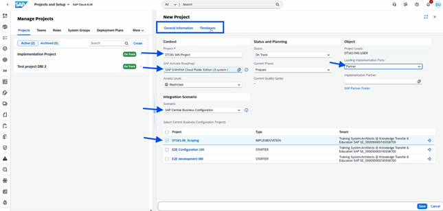

12.	Open the `Timeboxes` tab
 
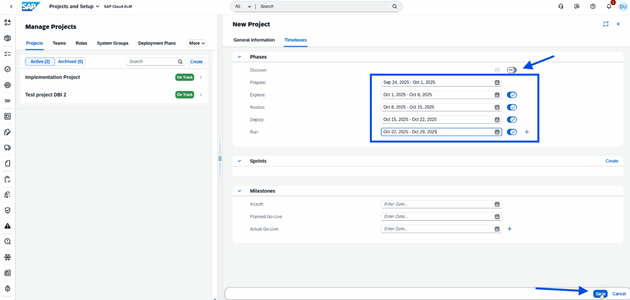

13.	`Deactivate` the *Discover* phase

14.	Enter the date range for the Prepare phase, starting with today and adding one week

15.	Do the same for the Explore, Realize, Deploy, and Run phases; all phases should have a one-week range

16.	Click `Save`

17.	The project is now created and appears on the left in the overview
 
## Teams and Scoping

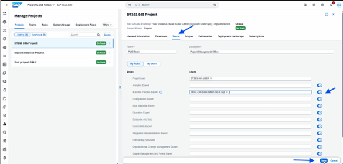

18.	Go to the Teams tab, click Edit and add yourself as a user under Business Process Expert with the email address `dt161-###@education.cloud.sap`

19.	Click `Save`

20.	In the Scopes tab, click `Manage Scopes`

**Note:** If an orange field (pop-up/toast message) appears, simply close it with X.
 


21.	Click `Create` and select *Scope from File*

22.	A window opens titled `New Scope`

23.	Enter *Finance* as the `Title`

24.	Under File, upload the `DDA File` from the previous exercise.

25.	For Solution Scenario Version, select *SAP Best Practices for *SAP S/4HANA Cloud Public Edition (2508)*

26.	Select *Germany* for `Country/Region`

27.	Click Review and then Create 

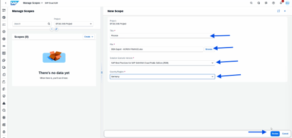

28.	A new window opens; click Process Scoping in the top right


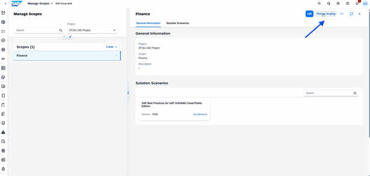

29.	In the Search field, enter and select: Accounting Enhancements for Banking (5NU) 

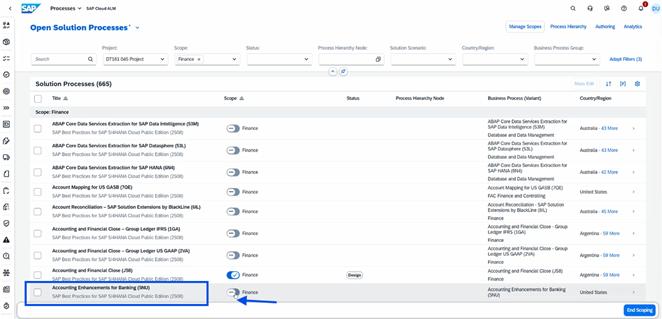

30.	Click on Project Overview ( first icon in menu bar)


## Tasks and Requirements

31.	click the number next to All Tasks under Upcoming Tasks. (Make sure that you have the Scope “Finance” selected as filter criteria)
 
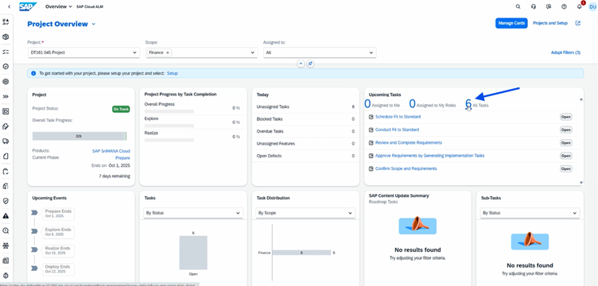

32.	The next window displays an overview of the Tasks

33.	Click on the task *Conduct Fit Standard*
 
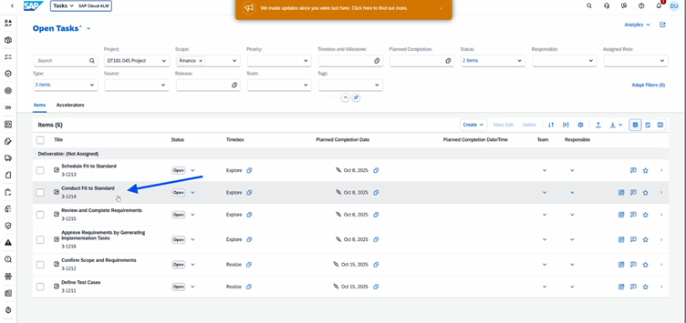
 
34.	A window with the task overview opens on the right. Click the symbol next to Create Sub task (the one that looks like a process step/document)
 
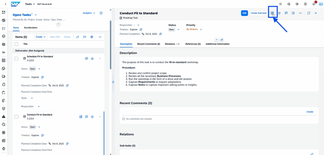

35.	Click on `Accounting and Financial Close (J58)`

36.	In the next step, click the `Solution Process Flow` tab

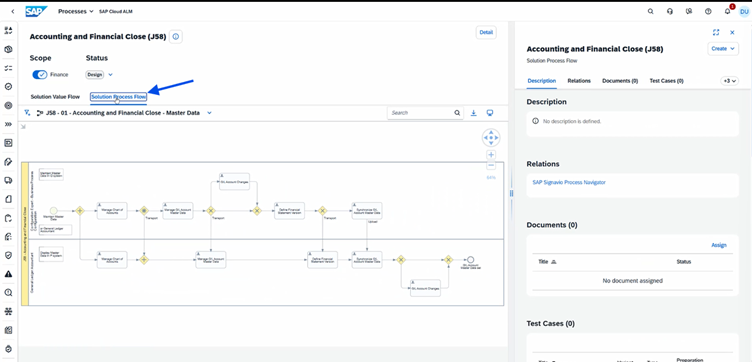
 
37.	Click the `Create` button in the overview on the right ( Make sure that you are in the process J58, not in a process step!!)

38.	Select *Requirement*

39.	A new window opens with New Requirement

40.	Add `DT161-###` to the Title

41.	Add a Requirement Description

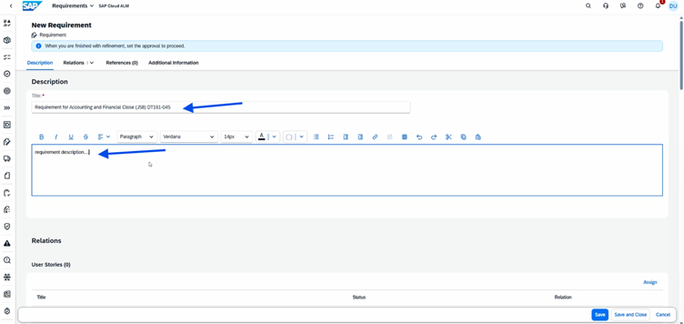 

42.	`Save and Close` the window

43.	You are now back in the Solution Process Flow overview

44.	Scroll down to the Requirements section in the overview

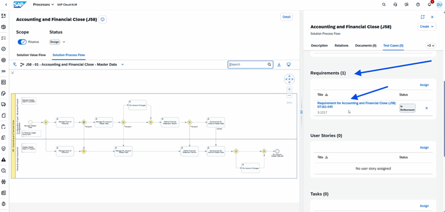 
 
45.	Click on your Requirement. In the right-hand window, click `Edit` to process it and scroll down to the *Additional Information* section

46.	For `Approval`, select *No Approval Required*

47.	For `Workstream`, select *Application Design and Configuration*

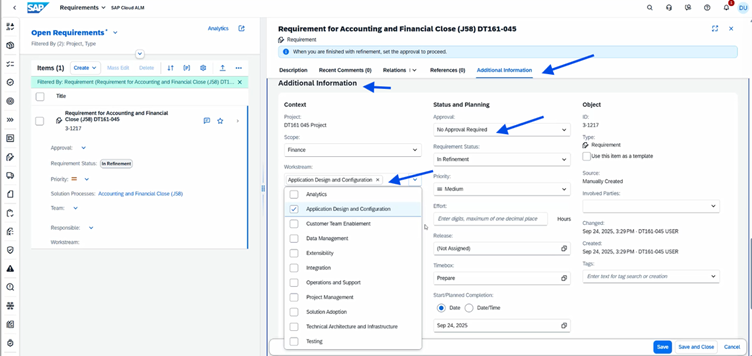 
 
48.	Scroll further down and select yourself as the Responsible party: `DT161-### USER`

49.	In `Tags`, add *fit*

50.	For `Requirement Status`, select *In Planning*

51.	Click `Save and Close`

52.	Click the third icon from the top on the left (Tasks)

53.	In the Open Tasks overview, `remove` the Scope filter if present

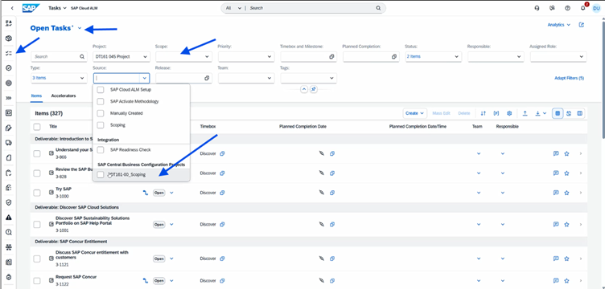 
 
54.	Filter the Source for `DT161-00_Scoping`

55.	Add the filter `Done` to the Status 

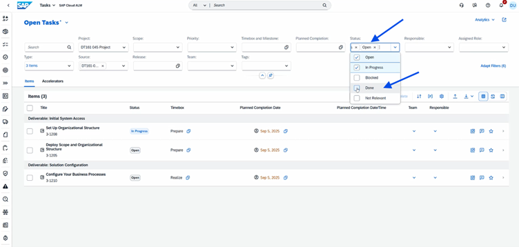  

Select the item Specify Primary Finance Settings and click the symbol on the right (the one that looks like a process step/document, see image) to navigate to CBC overview. 

**Note:** You may need to log in again. In case you get a login pop up, please use the same user as for Cloud ALM.

```terraform
    Username: DT161-###@education.cloud.sap
    Password: Acce$$teched25
```

**Note:** You might have to switch  the workspace in CBC. Please select the DT161 workspace and continue.

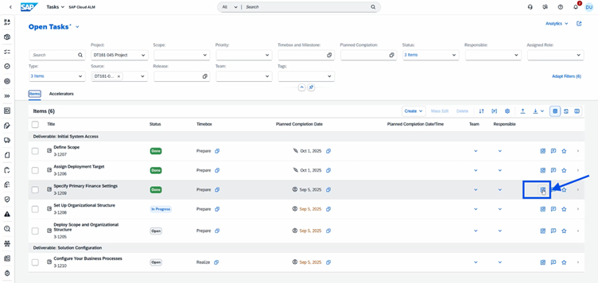 
 
56.	You are now in CBC and can read the Finance settings

57.	Go to Overview and compare the activities with the tasks from SAP Cloud ALM (no action required).

58.	Go back to `Cloud ALM` tab in Browser.


 
## Test Preparation and Execution

59.	Click the third icon on the left again to open the `Open Tasks overview`

60.	Click the 11th icon on the left (`Test Preparation`)

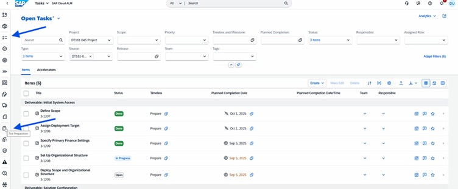 

 
61.	The `Test Preparation` overview opens. Here, select *Finance* under the Scope filter

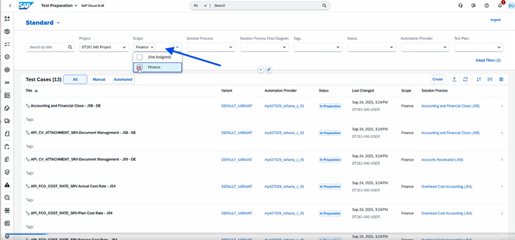 
 
62.	Click on Test Case: `Accounting and Financial Close - J58 - DE`

63.	A window opens with the overview. Click the second tab: `Relations`

64.	Then click `Requirements` and `Assign`

65.	A window opens (`Assign Requirements`). Select the Requirement for Accounting and Financial Close (J58) `DT161-###`

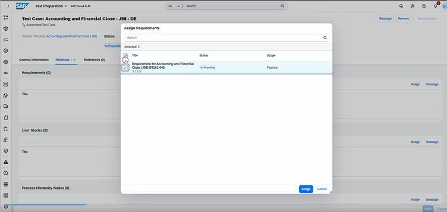 

66.	Click the `Save` button

67.	Set the `Status` from *In Preparation* to *Prepared* (in 
the header)

68.	Click `Save` again

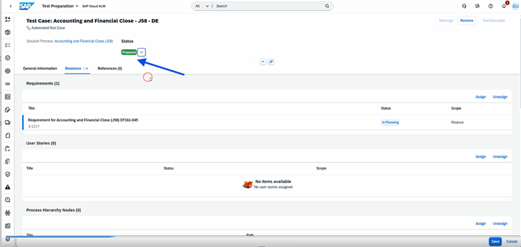 

> Optional part: if you have only few time left for this exercise , you can continue with Step 99 – Analytics, to close the exercise 

69.	Go back to the `Test Preparation` overview. Click the `Create` button.

70.	The New Test Case window opens on the right. Enter the following:

71.	`Type`: Manual

72.	`Title`: Manual test for J60

73.	`Scope`: Finance

74.	`Solution Process`: Accounts Payable (J60)

75.	`Solution Process Flow Diagram`: J60 – 01 – Main (Germany+ many)

76.	Click `Save`

 


77.	The Manual Test Case window opens. Set all toggles to a check mark under Scope

78.	Click `Save` at the end

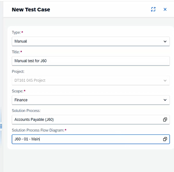 
 
79.	The Content tab opens. Click `Edit` (pencil) for the first step.

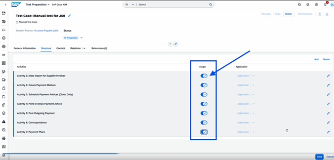 
 
80.	`Title`: Login

81.	`Instructions`: User: ABC, PW: xyz

82.	Click `OK`

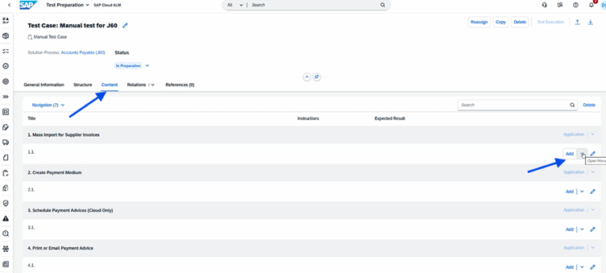  

83.	In the `Manual Test Case` overview, click `Save`

84.	Set the `Status` from In *Preparation* to *Prepared*

85.	Click the `Save` button again

86.	Click `Back`

87.	In the `Test Cases` overview, filter the `Status` for *Prepared*

88.	The two test cases should now appear

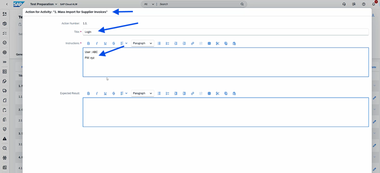 
 

89.	Next, click the Test `Execution` symbol on the far left

 
 
90.	`Remove` the filter for Test Plan Status

91.	Click `Execute` for the Manual Test for J60

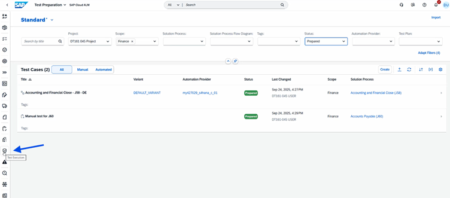 
 
92.	Set the `Login step` from Set to Pass to Fail

93.	`Enter` URL missing in the comments

94.	`Save` and then click `Create defect`

  

95.	A window opens with `New Defect`

96.	`Title`: Manual Test for J60 Login issue

97.	`Description`: Please include URL in test case

98.	Click `Save`

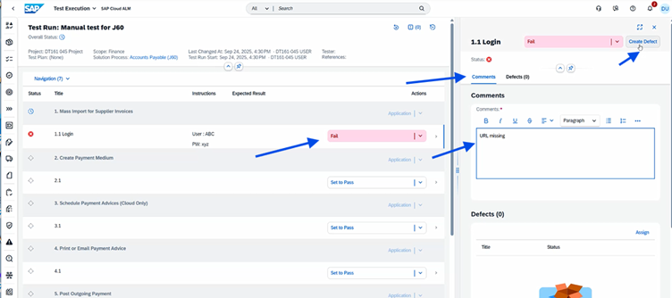  


## Analytics and Sign Out

99.	Next, click the `Analytics` symbol on the far left of the menu

![SAP BTP Account explorer - subdomain]./images/32.png) 

100.	Click the box titled `Solution Process Traceability`

101.	When you hover the mouse over the colored bars, more information appears

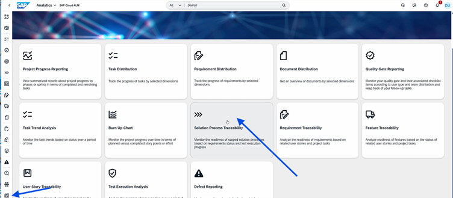 
 
102.	Click on `Indirect Assignments`, then slide the toggle next to Defect to the right, and click `OK`

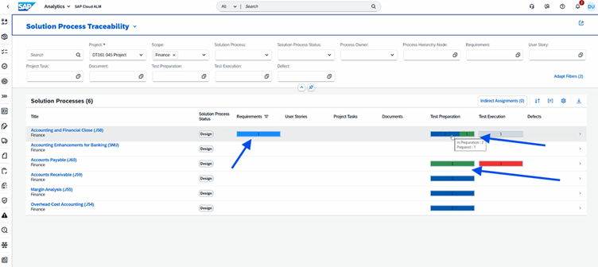 
 
103.	The `Defects column` now appears in the overview

104.	Go to the `Start Page` (SAP logo), click your `User` (top right), and `Sign Out`

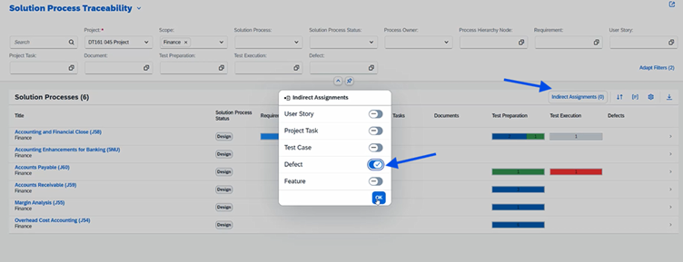 

Continue to - [Exercise 3 - SAP Central Business Configuration](../ex3/Ex3-CBC.md)